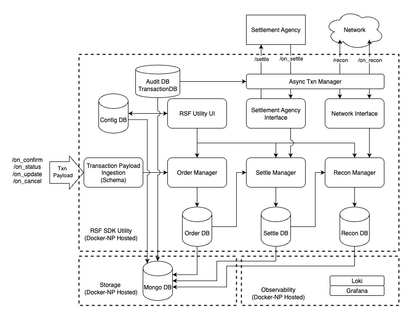
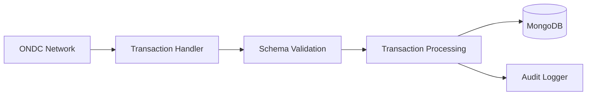
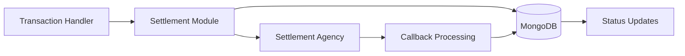
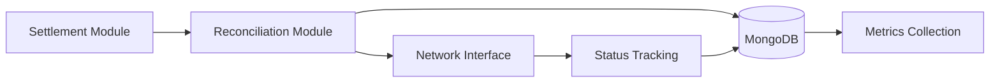

# RSF Utility System Architecture

This document provides a high-level overview of the RSF Utility system architecture. For detailed implementation guides, refer to the specific documentation linked in each section.

## Quick Links
- [Database Integration Guide](./DATABASE_INTEGRATION.md)
- [Observability Integration Guide](./OBSERVABILITY_INTEGRATION.md)
- [API Documentation](./API.md)
- [Installation Guide](./INSTALLATION.md)

## Table of Contents
- [System Overview](#system-overview)
- [Core Architecture](#core-architecture)
- [Data Flow](#data-flow)
- [Integration Points](#integration-points)
- [Technical Implementation](#technical-implementation)

## System Overview

RSF Utility is built as a modular transaction processing system with the following key capabilities:

1. Transaction payload ingestion and processing
2. Settlement management with external agencies
3. Reconciliation with network
4. Administrative UI
5. Data persistence and audit
6. System monitoring and observability

## Core Architecture

### Component Overview


### 1. Service Layer
```typescript
// Main service components and their responsibilities
interface ServiceArchitecture {
    frontend: {
        ui: "React SPA",
        auth: "JWT-based",
        communication: "HTTPS"
    },
    backend: {
        runtime: "Node.js + TypeScript",
        api: "RESTful endpoints",
        security: "Rate limiting + Auth"
    }
}
```

> For detailed API documentation and endpoints, see [API Documentation](./API.md)

### 2. API Structure
```typescript
// Core API Groups
const endpoints = {
    transaction: [
        "/on_confirm",   // Order confirmation
        "/on_status",    // Status updates
        "/on_update",    // Order updates
        "/on_cancel"     // Cancellation
    ],
    settlement: [
        "/settle",      // Initiate settlement
        "/on_settle"    // Settlement callbacks
    ],
    reconciliation: [
        "/recon",       // Start reconciliation
        "/on_recon"     // Reconciliation updates
    ]
}

### 3. Core Services

> Detailed service implementations can be found in `src/services/`

```typescript
// Core Service Architecture
interface CoreServices {
    TransactionHandler: {
        validation: "ONDC Protocol Schema",
        tracking: "Transaction Correlation",
        routing: "Message State Management"
    },
    SettlementManager: {
        requests: "Settlement Composition",
        tracking: "State Management",
        integration: "Agency Communication"
    },
    ReconciliationEngine: {
        matching: "Transaction Reconciliation",
        calculations: "Financial Processing",
        sync: "Network State Management"
    },
    MonitoringSystem: {
        health: "System Metrics",
        database: "Connection Monitoring",
        metrics: "Prometheus Integration"
    }
}
```

### 4. External Interfaces

#### Settlement Agency Interface
- External settlement agency communication
- Settlement request handling
- Callback processing

#### Network Interface
- Network endpoint communication
- Reconciliation request handling
- Response processing

## Data Flow

### 1. Transaction Flow


### 2. Settlement Flow


### 3. Reconciliation Flow


## External Interfaces

### 1. ONDC Network Interfaces

#### Registry Endpoints
- **Environment-specific Registry URLs**
  ```
  STAGING:  https://staging.registry.ondc.org/v2.0/
  PREPROD:  https://preprod.registry.ondc.org/v2.0/
  PROD:     https://prod.registry.ondc.org/
  ```

#### Transaction Endpoints
- **Incoming Transaction APIs**
  - `/on_confirm` - Order confirmation handling
  - `/on_status` - Order status updates
  - `/on_update` - Order updates
  - `/on_cancel` - Order cancellation
  
- **Features**
  - Schema validation against ONDC protocol
  - Transaction ID and Message ID tracking
  - State management and persistence
  - Error handling with NACK responses

### 2. Settlement Agency Interface

#### Configuration
```typescript
interface SettlementAgencyConfig {
    agencyUrl: string;    // Settlement agency endpoint
    agencyId: string;     // Agency identifier
    agencyKey: string;    // Authentication key
}
```

#### Endpoints
- **Settlement Operations**
  - `/settle` - Initiate settlement requests
  - `/on_settle` - Handle settlement callbacks
  
- **Features**
  - Transaction correlation with IDs
  - Error handling and retries
  - Settlement status tracking

### 3. Reconciliation Interface

#### Endpoints
- **Reconciliation Operations**
  - `/recon` - Initiate reconciliation
  - `/on_recon` - Handle reconciliation responses

- **Features**
  - Batch order processing
  - Atomic updates
  - Status tracking (INACTIVE, ERROR, SENT_PENDING, etc.)
  - Financial breakdown tracking

### 4. Administrative Interface

#### Configuration
```typescript
interface OperationConfig {
    rateLimit: number;    // API rate limiting (default: 1000)
}
```

#### Features
- **Authentication**
  ```typescript
  interface SubscriberConfig {
      subscriberId: string;
      subscriberUniqueId: string;
      subscriberPrivateKey: string;
  }
  ```

- **UI Endpoints**
  - User management and configuration
  - Transaction monitoring
  - Settlement status tracking
  - Reconciliation management
  - System health monitoring

#### Security
- JWT authentication
- API key validation
- Rate limiting
- Role-based access control

## Technical Implementation

### Database Architecture
> Detailed setup and configuration available in [Database Integration Guide](./DATABASE_INTEGRATION.md)

```typescript
// Core Database Configuration
interface DatabaseArchitecture {
    type: "MongoDB",
    config: {
        uri: string,          // Connection string
        monitoring: boolean,  // Health checks enabled
        indexes: "Automatic"  // Via Mongoose schemas
    },
    features: [
        "Health Monitoring",
        "Prometheus Metrics",
        "Auto-reconnection"
    ]
}
```

### 2. Collection Structure
```
MongoDB (rsf-utility)
├── Collections
│   ├── orders                 # Order management and tracking
│   │   └── Indexes:
│   │       ├── order_id
│   │       └── user_id
│   │
│   ├── settlements           # Settlement records and status
│   │   └── Indexes:
│   │       ├── user_id_order_id (unique)
│   │       └── settlement_id
│   │
│   ├── reconciliations      # Reconciliation records
│   │   └── Indexes:
│   │       ├── user_id
│   │       ├── order_id
│   │       ├── settlement_id
│   │       └── recon_status
│   │
│   ├── rsf_transactions     # All RSF-related transactions
│   │   └── Indexes:
│   │       ├── context.action
│   │       └── context.domain
│   │
│   └── users               # User and provider configurations
│       └── Indexes:
│           ├── role_subscriber_url_domain (unique)
│           └── title (unique)
│
└── Implemented Features
    ├── Automatic Indexing        # Via Mongoose schemas
    ├── Health Monitoring         # 30-second intervals
    ├── Prometheus Integration    # Health metrics
    └── Connection Management     # Auto-reconnect
```

### 2. Key Collections

#### Orders Collection
```typescript
interface Order {
    order_id: string;
    user_id: string;
    bap_uri: string;
    bpp_uri: string;
    bap_id: string;
    bpp_id: string;
    domain: string;
    provider_id: string;
    state: OrderState;
    created_at: Date;
    updated_at: Date;
    collected_by: "BAP" | "BPP";
    msn: boolean;
    settlement_counterparty: string;
    buyer_finder_fee_amount: number;
    buyer_finder_fee_type: string;
    settlement_basis: string;
    settlement_window: string;
    withholding_amount: number;
    item_tax: number;
    settle_status: INTERNAL_ORDER_SETTLE_STATUS;
    quote: {
        total_order_value: number;
        breakup: Array<{
            title: string;
            price: number;
            id: string;
        }>;
    };
}
```

#### Settlements Collection
```typescript
interface Settlement {
    order_id: string;
    user_id: string;
    settlement_id: string;
    collector_id: string;
    receiver_id: string;
    total_order_value: number;
    commission: number;
    collector_settlement: number;
    tds: number;
    tcs: number;
    withholding_amount: number;
    inter_np_settlement: number;
    provider_id?: string;
    due_date: Date;
    type: SETTLEMENT_TYPE;
    settlement_reference?: string;
    provider_settlement_reference?: string;
    self_settlement_reference?: string;
    error?: string;
    status: SETTLEMENT_STATUS;
    provider_status?: SETTLEMENT_STATUS;
    self_status?: SETTLEMENT_STATUS;
    transaction_db_ids: string[];
    createdAt: Date;
    updatedAt: Date;
}
```

#### Reconciliation Collection
```typescript
interface Reconciliation {
    user_id: string;
    order_id: string;
    collector_id: string;
    receiver_id: string;
    recon_status: INTERNAL_RECON_STATUS;
    settlement_id: string;
    payment_id?: string;
    transaction_db_ids: string[];
    recon_breakdown: {
        amount: number;
        commission: number;
        withholding_amount: number;
        tcs: number;
        tds: number;
    };
}
```

#### Transactions Collection
```typescript
interface Transaction {
    context: {
        domain: "ONDC:NTS10";
        location: {
            country: { code: string };
            city: { code: string };
        };
        version: "2.0.0";
        action: "recon" | "on_recon" | "settle" | "on_settle";
        // ... other context fields
    };
    currency: {
        currency: "INR";
        value: string;
    };
    timestamps: {
        createdAt: Date;
        updatedAt: Date;
    };
}
```

#### Users Collection
```typescript
interface User {
    title: string;
    role: "BAP" | "BPP";
    subscriber_url: string;
    domain: string;
    np_tcs: number;
    np_tds: number;
    pr_tcs?: number;
    pr_tds?: number;
    msn: boolean;
    provider_details: Array<{
        provider_name: string;
        provider_id: string;
        account_number: string;
        ifsc_code: string;
        bank_name: string;
    }>;
    counterparty_ids: string[];
    createdAt: Date;
    updatedAt: Date;
}
```

### Security Implementation
> For detailed security configurations, see [Security Guide](./SECURITY.md)

```typescript
// Core Security Architecture
interface SecurityStack {
    authentication: {
        type: "JWT",
        config: {
            secret: string,    // JWT_SECRET
            clientId: string   // CLIENT_ID
        }
    },
    rateLimit: {
        window: "1 minute",
        limit: number,        // Default: 1000
        headers: "draft-8"    // Standard headers
    },
    implementation: "./src/middlewares/auth-handler.ts"
}
- Global rate limiting per minute
- Configurable limits through environment variables
- Standard rate limit headers (draft-8 specification)
- Custom error handling for limit exceeded

### 3. Request/Response Security
- HTTPS encryption for all communications
- API key authentication for external services
- Request signing for Settlement Agency communications
- Comprehensive security headers

### 4. Data Security & Auditing
- Correlation ID tracking across requests
- Encrypted sensitive data (banking details, keys) #TODO
- Comprehensive request logging
  ```typescript
  {
      method: string;
    url: string;
    body: any;
    query: any;
    correlationId: string;
    params: any;
  }
  ```
- Response audit logging
  ```typescript
  {
      statusCode: number;
      correlationId: string;
  }
  ```
- RSF-specific audit logging for all operations
- Database-level validation and sanitization

### Observability Architecture
> Complete setup instructions in [Observability Integration Guide](./OBSERVABILITY_INTEGRATION.md)

```typescript
// Monitoring Architecture
interface ObservabilityStack {
    logging: {
        development: {
            transport: "Console",
            format: "Developer friendly"
        },
        production: {
            transport: "Loki",
            aggregation: "Centralized"
        },
        implementation: "./src/utils/logger/"
    },
    metrics: {
        provider: "Prometheus",
        endpoint: "/metrics",
        collectors: [
            "system_cpu_usage",
            "system_memory_usage",
            "db_health_status"
        ]
    },
    logging: {
        provider: "Winston + Loki",
        config: "src/utils/logger/",
        modes: {
            development: "Console transport",
            production: "Loki transport"
        }
    }
}

// Environment Configuration
// .env configuration
const observabilityConfig = {
    required: {
        NODE_ENV: "production",
        LOG_LEVEL: "info"
    },
    optional: {
        LOKI_HOST: "http://loki:3100",
        PORT: 4000
    }
}
```

For more detailed information about specific components, please refer to the respective documentation in the `docs/` directory.
